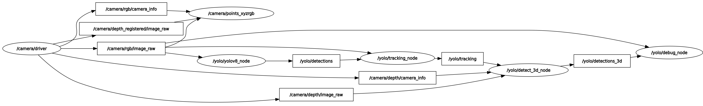
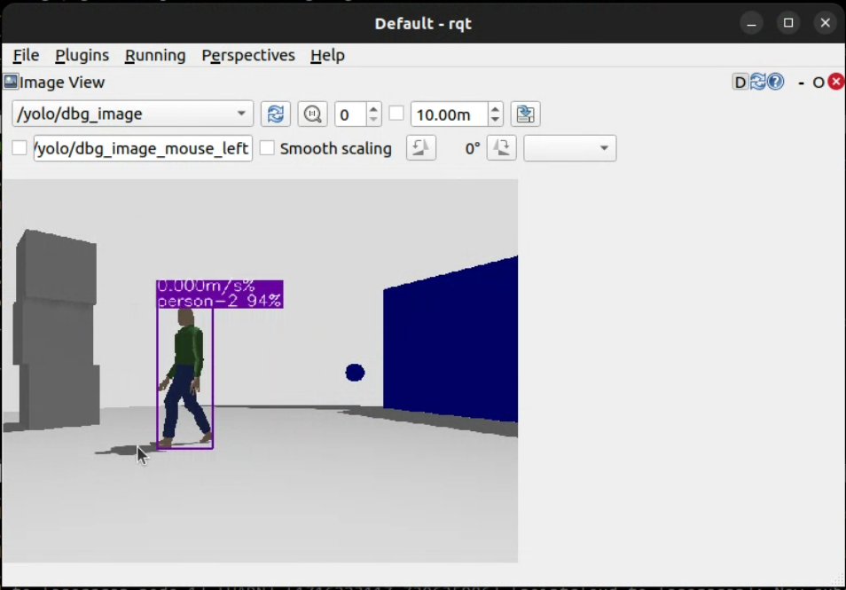
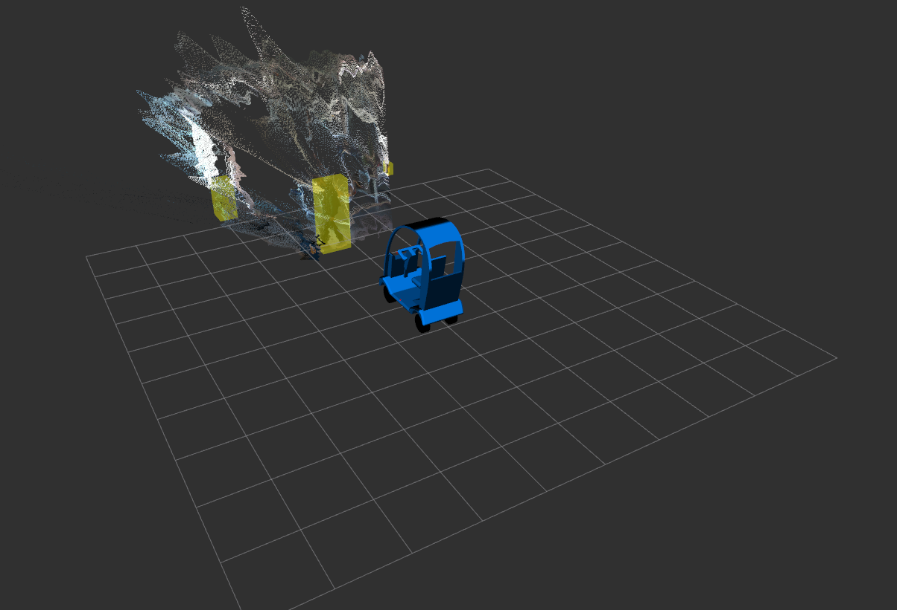

# yolov8_ros

ROS 2 wrap for [Ultralytics YOLOv8](https://github.com/ultralytics/ultralytics) to perform object detection and tracking, instance segmentation and human pose estimation. There are also 3D versions of object detection and human pose estimation based on depth images.

## Installation

```shell
$ cd ~/ros2_ws/src
$ git clone https://github.com/Rak-r/yolov8_ros2_OpenPodCarV2.git
$ pip3 install -r yolov8_ros/requirements.txt
$ cd ~/ros2_ws
$ rosdep install --from-paths src --ignore-src -r -y
$ colcon build
```

#### Topics

- **/yolo/detections**: Objects detected by YOLO using the RGB images. Each object contains a bounding boxes and a class name. It may also include a mak or a list of keypoints.
- **/yolo/tracking**: Objects detected and tracked from YOLO results. Each object is assigned a tracking ID.
- **/yolo/debug_image**: Debug images showing the detected and tracked objects. They can be visualized with rviz2.

#### Parameters

- **model**: YOLOv8 model (default: yolov8m.pt)
- **tracker**: Tracker file (default: bytetrack.yaml)
- **device**: GPU/CUDA (default: cuda:0)
- **enable**: Wether to start YOLOv8 enabled (default: True)
- **threshold**: Detection threshold (default: 0.5)
- **input_image_topic**: Camera topic of RGB images (default: /camera/rgb/image_raw)
- **image_reliability**: Reliability for the image topic: 0=system default, 1=Reliable, 2=Best Effort (default: 2)


#### Topics

- **/yolo/detections**: Objects detected by YOLO using the RGB images. Each object contains a bounding boxes and a class name. It may also include a mask or a list of keypoints.
- **/yolo/tracking**: Objects detected and tracked from YOLO results. Each object is assigned a tracking ID.
- **/yolo/detections_3d**: 3D objects detected. YOLO results are used to crop the depth images to create the 3D bounding boxes and 3D keypoints.
- **/yolo/detections_speed**: Reports the walking speed of the pedestrian using linear Kalman filter approach.
- **/yolo/debug_image**: Debug images showing the detected and tracked objects. They can be visualized with rviz2.

#### Parameters

- **model**: YOLOv8 model (default: yolov8m.pt)
- **tracker**: tracker file (default: bytetrack.yaml)
- **device**: GPU/CUDA (default: cuda:0)
- **enable**: wether to start YOLOv8 enabled (default: True)
- **threshold**: detection threshold (default: 0.5)
- **input_image_topic**: camera topic of RGB images (default: /camera/rgb/image_raw)
- **image_reliability**: reliability for the image topic: 0=system default, 1=Reliable, 2=Best Effort (default: 2)
- **input_depth_topic**: camera topic of depth images (default: /camera/depth/image_raw)
- **depth_image_reliability**: reliability for the depth image topic: 0=system default, 1=Reliable, 2=Best Effort (default: 2)
- **input_depth_info_topic**: camera topic for info data (default: /camera/depth/camera_info)
- **depth_info_reliability**: reliability for the depth info topic: 0=system default, 1=Reliable, 2=Best Effort (default: 2)
- **depth_image_units_divisor**: divisor to convert the depth image into metres (default: 1000)
- **target_frame**: frame to transform the 3D boxes (default: base_link)
- **maximum_detection_threshold**: maximum detection threshold in the z axis (default: 0.3)


## Changes


* The existing ROS2 wrapper provides general capabilties to use yolov8 for object detection and other computer vision related task with robotics. However, when deployed on the real-physical autonomous vehicl platform, it is observed that at the task of Simultaneous Localization and Mapping, the moving pedestrians in fron tof the robot makes the SLAM to struggle for localizaing the roboot. The Odometry and SLAM stack is based on RTABMAP. It is also observed that due to localization drifts, the NAV2 stack mistakenly generates off-track plans which the controller server strggles to follow and end uo oscillating.

* To handle the above mentioned scenario, the incoming depth image from the rgbd camera, is masked out in the regions where the objects are dtecetd and tracked by taking tne output dimensions of boudning box from 2D detection node (`yolov8_node.py`). 

* After masking out the regions, the new depth image message is published over the topic named, `/masked_depth`.

* The above is tested by heavily moving infront if the camera and it is observed that the lcoalization drfits are now controlled along with good rgbd odometry (both from RTABMAP) as RTABMAP do no consider the region with zero depth. Further it is tested with NAV2 controller to follow the desired goals.

* For Pedestrain-AV interaction tasks, extracting the pedestrian velocity is viable element to determine their trajectories, to fit the data into models relying on pedestrian behaviour.

The above has been discussed in the main repository with given suggestions, run tests and has been integrated using the Linear Kalman filter approach.
The full discussion can be found here: https://github.com/mgonzs13/yolov8_ros/issues/18 

## Usage

## Object Detection in Gazebo Sim


Node graph:

<p align="center">
  
</p>

This is the standard behavior of YOLOv8, which includes object tracking.

```shell
$ ros2 launch yolov8_bringup yolov8.launch.py
```

<p align="center">
  
</p>


### Pedestrian viewed in Sim while Mapping and Navigating

https://github.com/Rak-r/yolov8_ros2_OpenPodCarV2/raw/main/Images/Peddet_sim.mp4


## 3D Object Detection in real time

The 3D bounding boxes are calculated filtering the depth image data from an RGB-D camera using the 2D bounding box. Only objects with a 3D bounding box are visualized in the 2D image.

```shell
$ ros2 launch yolov8_bringup yolov8_3d.launch.py
```

<p align="center">
  
</p>

